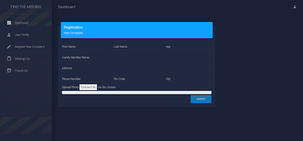

# Find the missing 🫂

> This Project is a submission for Microsoft Engage 2022.

**Our vision is for every missing child and adult, and every loved one left behind, to find help, hope and a safe way to reconnect.**

 
  
  
# Features :
* Seperate Authentication System for Police Administration and User.

- Once logged in, Police can upload the details and photos of missing victims.

- For User, whenever they find a lost person, he/she can upload their photos and out System will check if there is any victim who matches with that person.

- For matching faces, we are using ML Rekognition which provided efficient and quick results.

- If a suspect and victim matches, we'll inform the police through email and notification.

# How it works?

We have two portals, one for the police and one for the finder.
Let me explain this further by taking an example. If a person goes missing, his family will approach the police and will file a missing complaint for him. The police will login to the website and will fill in the details of the person here in the police panel. These details will be saved in the police database of the missing people. Now we have the finders panel, suppose someone finds the same person in another city, he can click a picture and upload the details of the found suspect by logging into the website through the finder panel. When he clicks on the ‘match-face’ option, the suspect photo will be matched through the pictures in police data records of missing people. If the face matches, the police will be informed via email or notification and the information will be updated in the list of found people.

# Architectural Diagram

# Tech Stack :

- HTML
- CSS
- PHP
- Firebase and FireStore
- AWS Face Rekognition
- Elastic Mail

# Requirements :

- Code Editor
- Xampp
- Apache server

# Setting up the Project (Contribute) :

- clone the repository
  - `git clone https://github.com/vidushi07/FindTheMissing.git`
- Download and start Xampp
- Run apache server
- Goto htdocs (in windows)
  - Copy and paste your FindTheMissing folder in htdocs (in windows). For unix system the location may be different.
- Goto `localhost/findthemissing` and start using the application

# Website Images:

 

 

# Video ✨

<a href="https://youtu.be/FHuhs8pLcjs">https://youtu.be/FHuhs8pLcjs</a>

# Live link 🔗

Live link of the website:

<a href="findthemissing.herokuapp.com">findthemissing.herokuapp.com</a>

---
